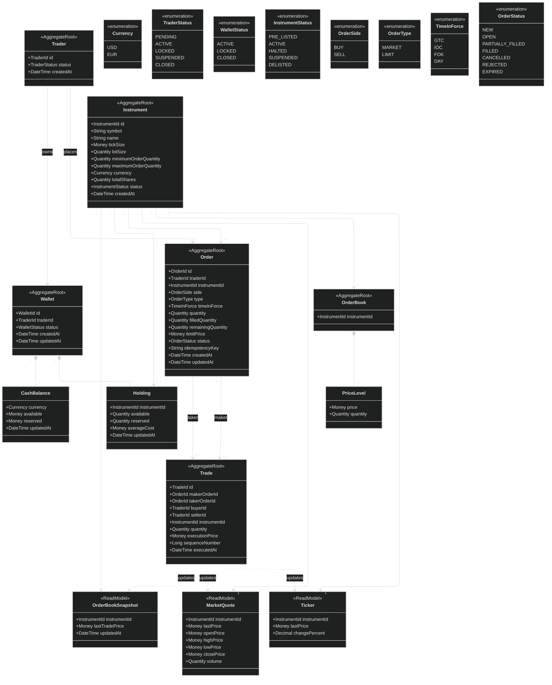

```mermaid
---
config:
  theme: dark
  layout: elk
---
classDiagram

%% ==========================================================
%% AGGREGATE ROOTS
%% ==========================================================

class Trader {
    <<AggregateRoot>>
    +TraderId id
    +TraderStatus status
    +DateTime createdAt
}

class Instrument {
    <<AggregateRoot>>
    +InstrumentId id
    +String symbol
    +String name
    +Money tickSize
    +Quantity lotSize
    +Quantity minimumOrderQuantity
    +Quantity maximumOrderQuantity
    +Currency currency
    +Quantity totalShares
    +InstrumentStatus status
    +DateTime createdAt
}

class Wallet {
    <<AggregateRoot>>
    +WalletId id
    +TraderId traderId
    +WalletStatus status
    +DateTime createdAt
    +DateTime updatedAt
}

class Order {
    <<AggregateRoot>>
    +OrderId id
    +TraderId traderId
    +InstrumentId instrumentId
    +OrderSide side
    +OrderType type
    +TimeInForce timeInForce
    +Quantity quantity
    +Quantity filledQuantity
    +Quantity remainingQuantity
    +Money limitPrice
    +OrderStatus status
    +String idempotencyKey
    +DateTime createdAt
    +DateTime updatedAt
}

class Trade {
    <<AggregateRoot>>
    +TradeId id
    +OrderId makerOrderId
    +OrderId takerOrderId
    +TraderId buyerId
    +TraderId sellerId
    +InstrumentId instrumentId
    +Quantity quantity
    +Money executionPrice
    +Long sequenceNumber
    +DateTime executedAt
}

class OrderBook {
    <<AggregateRoot>>
    +InstrumentId instrumentId
}

%% ==========================================================
%% CHILD ENTITIES
%% ==========================================================

class CashBalance {
    +Currency currency
    +Money available
    +Money reserved
    +DateTime updatedAt
}

class Holding {
    +InstrumentId instrumentId
    +Quantity available
    +Quantity reserved
    +Money averageCost
    +DateTime updatedAt
}

class PriceLevel {
    +Money price
    +Quantity quantity
}

%% ==========================================================
%% READ MODELS
%% ==========================================================

class OrderBookSnapshot {
    <<ReadModel>>
    +InstrumentId instrumentId
    +Money lastTradePrice
    +DateTime updatedAt
}

class MarketQuote {
    <<ReadModel>>
    +InstrumentId instrumentId
    +Money lastPrice
    +Money openPrice
    +Money highPrice
    +Money lowPrice
    +Money closePrice
    +Quantity volume
}

class Ticker {
    <<ReadModel>>
    +InstrumentId instrumentId
    +Money lastPrice
    +Decimal changePercent
}

%% ==========================================================
%% ENUMS
%% ==========================================================

class Currency {
    <<enumeration>>
    USD
    EUR
}

class TraderStatus {
    <<enumeration>>
    PENDING
    ACTIVE
    LOCKED
    SUSPENDED
    CLOSED
}

class WalletStatus {
    <<enumeration>>
    ACTIVE
    LOCKED
    CLOSED
}

class InstrumentStatus {
    <<enumeration>>
    PRE_LISTED
    ACTIVE
    HALTED
    SUSPENDED
    DELISTED
}

class OrderSide {
    <<enumeration>>
    BUY
    SELL
}

class OrderType {
    <<enumeration>>
    MARKET
    LIMIT
}

class TimeInForce {
    <<enumeration>>
    GTC
    IOC
    FOK
    DAY
}

class OrderStatus {
    <<enumeration>>
    NEW
    OPEN
    PARTIALLY_FILLED
    FILLED
    CANCELLED
    REJECTED
    EXPIRED
}

%% ==========================================================
%% RELATIONSHIPS
%% ==========================================================

Trader "1" --> "1" Wallet : owns

Wallet "1" *-- "1..*" CashBalance
Wallet "1" *-- "0..*" Holding

Trader "1" --> "0..*" Order : places

Instrument "1" --> "0..*" Holding
Instrument "1" --> "0..*" Order

Order "1" --> "0..*" Trade : maker
Order "1" --> "0..*" Trade : taker

OrderBook "1" *-- "0..*" PriceLevel

Trade ..> OrderBookSnapshot : updates
Trade ..> MarketQuote : updates
Trade ..> Ticker : updates

Instrument "1" --> "1" OrderBook
Instrument "1" --> "1" OrderBookSnapshot
Instrument "1" --> "1" MarketQuote
Instrument "1" --> "1" Ticker
```