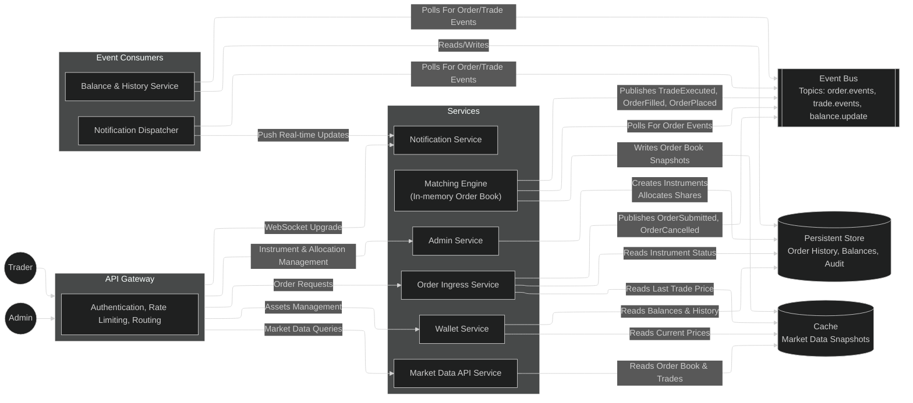

```mermaid
---
config:
  theme: dark
  layout: elk
---
flowchart LR
 subgraph Gateway["API Gateway"]
        GW["Authentication, Rate Limiting, Routing"]
  end
 subgraph EventConsumers["Event Consumers"]
        BHS["Balance & History Service"]
        ND["Notification Dispatcher"]
  end
 subgraph ServiceLayer["Services"]
        OIS["Order Ingress Service"]
        MDA["Market Data API Service"]
        NS["Notification Service"]
        WS["Wallet Service"]
        ME["Matching Engine<br>(In-memory Order Book)"]
        AD["Admin Service"]
  end
    Trader(("Trader")) --> Gateway
    Admin(("Admin")) --> Gateway
    Gateway -- Order Requests --> OIS
    Gateway -- Market Data Queries --> MDA
    Gateway -- WebSocket Upgrade --> NS
    ND -- Push Real‑time Updates --> NS
    Gateway -- Assets Management --> WS
    Gateway -- "Instrument & Allocation Management" --> AD
    OIS -- Publishes OrderSubmitted, OrderCancelled --> EB[["Event Bus<br>Topics: order.events, trade.events, balance.update"]]
    ME -- Publishes TradeExecuted, OrderFilled, OrderPlaced --> EB
    ME -- Polls For Order Events --> EB
    BHS -- Polls For Order/Trade Events --> EB
    ND -- Polls For Order/Trade Events --> EB
    BHS -- Reads/Writes --> Store[("Persistent Store<br>Order History, Balances, Audit")]
    WS -- Reads Balances & History --> Store
    OIS -- "Reads Instrument Status" --> Store
    AD -- "Creates Instruments<br/>Allocates Shares" --> Store
    WS -- Reads Current Prices --> Cache[("Cache<br>Market Data Snapshots")]
    ME -- Writes Order Book Snapshots --> Cache
    MDA -- Reads Order Book & Trades --> Cache
    OIS -- "Reads Last Trade Price" --> Cache
    
```